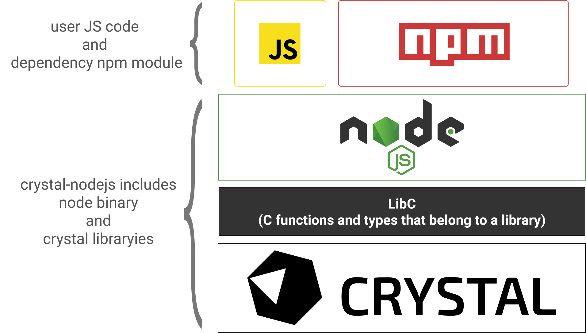
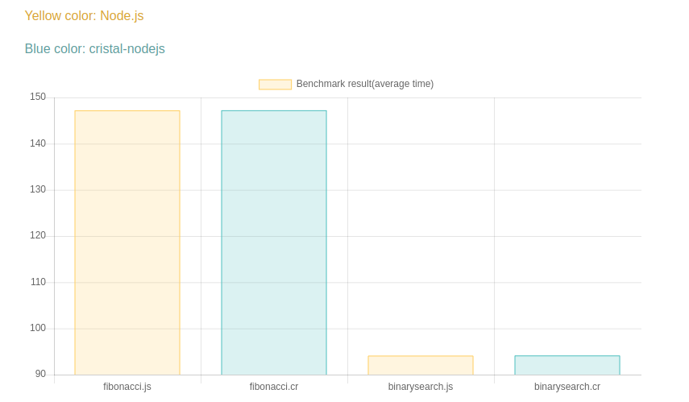

# crystal-nodejs

Node.js engine for crystal-lang. JS code and npm module executes on crystal-nodejs, And don't need to install Node.js binary.Explain about architecture, Compiled as a shared object Node.js(i.e: libnodejs) and execute as one process on crystal-lang. So call C execvp() system call through Process.run() method, execute in this c function.

Process.run method is low overhead, Compare pure Node.js js code and crystal-nodejs js code, There was no difference in performance(see Benchmark heading  about performance detail).

Using crystal-nodejs can pass through  Node.js result of crystal-lang. Happy Crystaling!! :tada:

<h4>Architecture image</h4>


In the above architecture image, crystal-nodejs provides Node.js, LibC, lib that was created crystal-lang


## Supported OS

- Linux(Ubuntu16.04, 18.04)
- MacOSX(High Sierra)
- Windows(Unfortunately yet not supported on crystal-lang...)

## Installation

1. Add the dependency to your `shard.yml`:

   ```yaml
   dependencies:
     nodejs:
       github: fukaoi/crystal-nodejs
   ```

2. Run `shards install`


3. libnodejs install, init js directory `make or make all`


## Usage

### Bacis usage

#### Output Hello crystal-nodejs !! on terminal

* Simple JS code, output 'Hello crystal-nodejs'

```js
require "nodejs"

Nodejs.eval("console.log('Hello crystal-nodejs !!')")
```
<br />

#### Use setTimeout execute lazy code

* below code is output 'Hello crystal' after 2sec

```js
require "nodejs"

code = <<-CODE
  let user = {
    sayHi(firstName) {
      console.log(`Hello, ${firstName}!`);
    }
  };
  setTimeout(() => {user.sayHi('crystal')}, 2000);
CODE

Nodejs.eval(code)
```
<br />

#### How to send Node.js result to crystal-lang

* Use special `toCrystal()` method.toCrystal() is only function in crystal-nodejs.Can response various type in JS,  and all JS type is converted `JSON::Any` in crystal

```js
require "nodejs"

code = <<-CODE
  toCrystal({data:"spec"})
CODE

res = Nodejs.eval(code)

puts res           # {"data" => "spec"}
puts typeof(res)   # JSON::Any
```
<br />

* The below example, all JS type(Number, Boolean, String) is converted `JSON::Any`.
```js
require "nodejs"

code = <<-CODE
  toCrystal({123456})
CODE

res = Nodejs.eval(code)

puts res           # 123456
puts typeof(res)   # JSON::Any
```

<br />

#### More usages look at [spec/nodejs/npm/](https://github.com/fukaoi/crystal-nodejs/tree/master/spec/nodejs/npm)

## Benchmark

This benchmark is fibonacci and binary-search results, As can see from the result, crystal-nodejs is high performance.below at bar chart is response average time that executes 5 times fibonacci and binary-search. benchmark source code detail  is can see from URL link

* Machine spec: 
  * cpu: Intel(R) Core(TM) i7-7820HK CPU @ 2.90GHz  4core
  * memory: 16Gbyte 

<br />

* Benchmark code:  
  * fibonacci source: [Node.js](https://github.com/fukaoi/crystal-nodejs/blob/benchmark/bench/fibonacci.js) [crystal-lang](https://github.com/fukaoi/crystal-nodejs/blob/benchmark/bench/binarysearch.cr)
  * binary-search source: [Node.js](https://github.com/fukaoi/crystal-nodejs/blob/benchmark/bench/binarysearch.js) [crystal-lang](https://github.com/fukaoi/crystal-nodejs/blob/benchmark/bench/binarysearch.cr)   




#### Raw data(Benchmark result)

* fibonacci

|  -  | Node.js | crystal-nodejs |
| ---- | ---- | ---- |
|  1  | real 2m26.968s | real 2m27.337s |
|  2  | real 2m27.230s | real 2m27.263s |
|  3  | real 2m26.987s | real 2m28.058s |
|  4  | real 2m27.582s | real 2m26.672s |
|  5  | real 2m27.262s | real 2m26.831s |


* binary-search

|  -  | Node.js | crystal-nodejs |
| ---- | ---- | ---- |
|  1  | real 1m35.699s | real 1m35.962s |
|  2  | real 1m35.082s | real 1m32.018s |
|  3  | real 1m33.309s | real 1m35.212s |
|  4  | real 1m34.423s | real 1m33.830s |
|  5  | real 1m32.050s | real 1m33.530s |


## Development

## Safety

## Contributing

1. Fork it (<https://github.com/fukaoi/crystal-nodejs/fork>)
2. Create your feature branch (`git checkout -b my-new-feature`)
3. Commit your changes (`git commit -am 'Add some feature'`)
4. Push to the branch (`git push origin my-new-feature`)
5. Create a new Pull Request

## Contributors

- [fukaoi](https://github.com/fukaoi) - creator and maintainer
